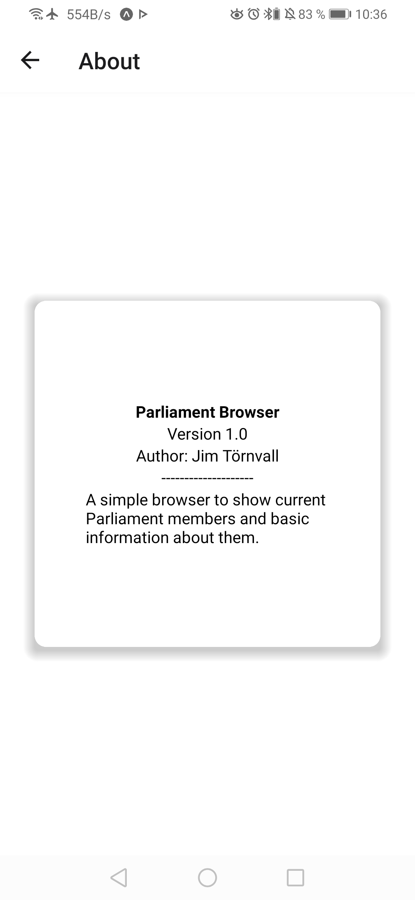

# Parliament Browser

For Aland Islands

## Functionallity

- Loads all currently active Parliament members (PM)
- Loads extended information of each PM
- Loads and caches images of PM's in the list view
  - Always loads the image from web in details view to make sure it is current

## Screenshots

(width=10)

## API used

<https://api.lagtinget.ax/api/persons.json>

## Development requirements

### Must have

- [x] The application consists of at least two pages
  - [x] One of which is a list of all sitting members of parliament
    - [x] Members of parliament are displayed in a FlatList
    - [x] The elements of the list utilize a third-party solution from, for example, React Native Elements or React Native Paper
- [x] The other page can be a welcome screen that is displayed when the application starts, or a detail view that is displayed when a member is selected from the list
- [x] React Navigation is used to move between the pages

### Should have

- [ ] A search field is used to search for members/filter the list of members
- [x] The members' photos are displayed as avatars in the list
- [ ] Utilizes mechanisms for handling application state, for example, through Context.
